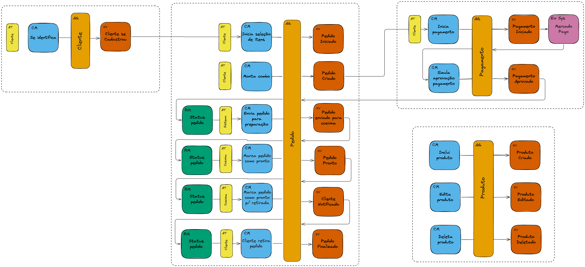

# Fastfood System

Este sistema foi desenvolvido utilizando **Node.js** e **MongoDB**, seguindo o padrão de **Arquitetura Hexagonal**. Ele gerencia pedidos de um sistema de fastfood, incluindo funcionalidades como criação de pedidos, gerenciamento de produtos, sistema de pontos para clientes e notificação por e-mail.

## Estrutura do Projeto

    fastfood-backend/
    ├── .env
    ├── .gitignore
    ├── Dockerfile
    ├── docker-compose.yaml
    ├── index.js
    ├── package.json
    ├── package-lock.json
    ├── src
    │   ├── application
    │   │   ├── controllers
    │   │   │   ├── clienteController.js
    │   │   │   ├── pagamentoController.js
    │   │   │   ├── pedidoController.js
    │   │   │   └── produtoController.js
    │   │   ├── dtos
    │   │   │   ├── clienteDto.js
    │   │   │   ├── pedidoDto.js
    │   │   │   └── produtoDto.js
    │   ├── domain
    │   │   ├── Cliente.js
    │   │   ├── Pedido.js
    │   │   └── Produto.js
    │   ├── infrastructure
    │   │   ├── database
    │   │   │   └── database.js
    │   │   ├── routes
    │   │   │   ├── clienteRoutes.js
    │   │   │   ├── pagamentoRoutes.js
    │   │   │   ├── pedidoRoutes.js
    │   │   │   └── produtoRoutes.js
    │   │   └── services
    │   │       ├── notificationService.js
    │   │       └── qrCodeService.js

## Funcionalidades

### Sistema de Pontos

- **Acúmulo de Pontos**: A cada pedido realizado, o cliente acumula pontos.
- **Recompensa**: Quando o cliente acumula 10 pontos, ele recebe uma notificação que ganhou um pedido gratuito.
- **Notificação de Pontos**: O sistema notifica o cliente por e-mail sobre a contagem de pontos e informa quando ele atingiu os 10 pontos para o próximo pedido gratuito.

### Notificação por E-mail

O sistema utiliza o **Nodemailer** para enviar notificações por e-mail:

- Notificação quando o pedido está pronto para retirada.
- Atualização da contagem de pontos após cada pedido finalizado.

### Integração com Mercado Pago

A aplicação está integrada com a **API do Mercado Pago** para simular transações de pagamento. Atualmente, uma rota `fake-checkout` é utilizada para simular a aprovação de pagamentos, garantindo flexibilidade durante o desenvolvimento e testes.

## Configuração de Variáveis de Ambiente

    MONGO_URI=<sua_string_de_conexão_com_mongo>
    PORT=3000
    MERCADOPAGO_ACCESS_TOKEN=<seu_token_de_acesso_mercado_pago>
    MERCADOPAGO_PUBLIC_KEY=<sua_chave_pública_mercado_pago>
    NGROK_URL=<sua_url_ngrok>
    EMAIL_USER=<seu_email_para_envio>
    EMAIL_PASS=<sua_senha_de_app>

**Nota**: Renomear o arquivo `.env.example` para `.env` e substituir os placeholders pelos valores corretos.

## Subindo o Sistema com Docker

### Construir e Subir os Containers

    docker-compose up -d

### Acessar a API

- **Documentação Swagger**: [http://localhost:3000/api-docs/](http://localhost:3000/api-docs/)
- **API disponível em**: [http://localhost:3000](http://localhost:3000)

### Instruções para Uso

1. **Clone esse Repositório**:
    git clone [https://github.com/eamaral/fastfood-backend.git](https://github.com/eamaral/fastfood-backend.git)
    cd fastfood-backend

2. **Configurar Variáveis de Ambiente**:
    - Renomeie o arquivo `.env.example` para `.env` e preencha com as suas credenciais.

3. **Construir e Rodar com Docker**:
    docker-compose up -d

4. **Acessar a Documentação da API**:
    - Abra o navegador e vá para [http://localhost:3000/api-docs/](http://localhost:3000/api-docs/) para ver a documentação interativa da API.

5. **Testar a API**:
    - Utilize ferramentas como **Postman** ou **Insomnia** para testar os endpoints da API em [http://localhost:3000](http://localhost:3000).

## Tecnologias Utilizadas

- **Node.js**: Ambiente de execução JavaScript.
- **MongoDB**: Banco de dados NoSQL.
- **Docker**: Contêineres para facilitar a configuração e distribuição.
- **Nodemailer**: Envio de e-mails.
- **Mercado Pago**: Integração para simulação de pagamentos.
- **Arquitetura Hexagonal**: Padrão de arquitetura para separar a lógica de negócio das interfaces externas.

## Licença

Este projeto está licenciado sob a licença [MIT](LICENSE).

